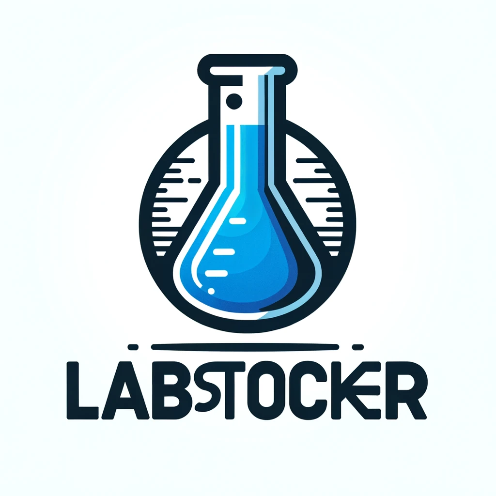

 ## Managing your lab stock

The **LabStocker**, is a web application designed to help manage your reagents and equipment in the lab. It allows lab partners to maintain an inventory of their supplies and to share an inventory database. It also enable users to keep track of equippent maintenance. 

## Getting Started  
[Link to Deployed App](<https://labstocker.netlify.app/>)

## Attributions  
- [Responsive Navbar in React using React Rou
ter | Beginner Tutorial](https://www.youtube.com/watch?v=17l6AOc8s10)

## Technologies Used  
HTML  
CSS  
JS  
MERN Stack:
- MongoDB
- Express
- React (React, React-DOM, React-Router-DOM)
- Node

## Next Steps  

Next steps would be to implement a Team chat and
add new features that need to be tracked.
